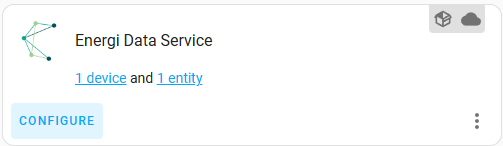

  

Energi Data Service for Home Assistant integrates Day Ahead spotprices for electricity, from the Energi Data Service API and provides fallback to Nord Pool if Energi Data Service for some reason does not have the given region.

The integration adds posibility to get a 5 day price forecast for the next week thru [Carnot.dk](https://carnot.dk) and also supports automatic pull and addition of tariffs to the price by selecting your charge owner (net operator, and only supported for the regions listed [HERE](#supported-countries-and-functions))

For additional Tips & Tricks, see the [wiki pages](https://github.com/MTrab/energidataservice/wiki) - this includes examples on how to [display prices in ApexChart](https://github.com/MTrab/energidataservice/wiki/Displaying-prices-in-Apexchart-card) and [some template examples](https://github.com/MTrab/energidataservice/wiki/How-to-add-costs-of-subscription-and-delivery%3F).

# Table of Content

**[Installation](#installation)** 
**[Setup](#setup)** 
**[Usage](#usage)** 
**[Supported countries and functions](#supported-countries-and-functions)** 
**[Translation](#translation)** 
**[FAQ](https://github.com/MTrab/energidataservice/wiki/FAQ)** 
**[Known subscription fees for Denmark](https://github.com/MTrab/energidataservice/wiki/How-to-add-costs-of-subscription-and-delivery%3F#additional-costs-template-when-using-tariff-data)** 

# Installation:

### Option 1 (easy) - HACS:

- Ensure that HACS is installed.
- Search for and install the "Energi Data Service" integration.
- Restart Home Assistant.

### Option 2 - Manual installation:

- Download the latest release.
- Unpack the release and copy the custom_components/energidataservice directory into the custom_components directory of your Home Assistant installation.
- Restart Home Assistant.

# Setup

My Home Assistant shortcut: 

Or go to Home Assistant > Settings > Integrations

Add "Energi Data Service" integration *(If it doesn't show, try CTRL+F5 to force a refresh of the page)*

### __Set initial info__
* Give the integration a name, a name HAS to be unique and the config will render an error if the name is in use
* If you want a FIXED PRICE sensor, select this in the country drop down

### __Set the detailed settings__
* Price area (if applicaple for your country selection)
* Show prices in VAT
  * Will automatically add VAT to the prices, depending on the country selected.
* Show prices in cent
  * Convert prices to be displayed as cents
* Prices in hourly intervals
  * Use price be hour instead of 15 minutes interval. Use if your electricity contract is calculated on hourly cost.
* Decimals
  * Round the prices to this number of decimals
* Price calculated in
  * Price calculations will be done pr. MWh, kWh or Wh depending on your selection
* Template for additional costs
  * If you want to add additional costs to the calculations, you can enter your Jinja2 template here. ([SEE MORE](https://github.com/MTrab/energidataservice/wiki/How-to-add-costs-of-subscription-and-delivery%3F))

### __Enable extra services__
_This is only available for your country and region selections and number of available services may differ as well)_
* AI forecasts from Carnot
  * AI generated price forecasts for your selected region, provided by Carnot (requires registration and API key from Carnot - this is free of charge)
* Automatically fetch tariff data
  * Automatically fetch and add tariffs for your country/region selection

### __API credentials for Carnot platform__
If enabling forecasts from Carnot, you will need to aquire an API key from [Carnot.dk](https://carnot.dk) by creating a user account and from there request the key.

### __Select net operator__
If enabling automatic tariff data, then you'll need to select your net operator - this is _NOT_ the same as the company from which you buy your electric. 
Use the link in the box to find your operator.

# Usage

If you ever need to change some settings, you can always go to the integrations page and press the Configure link.

The integration creates 1 sensor with the state representing the price for the current hour. 
To find prices for other hours, please go and find these in the attributes of this sensor.

Here you have a list of the available attributes, along with a brief description
Attribute name | Description | Adittional info
---|---|---
current_price | Price for the current hour, same as the sensor state|
unit | The unit used for price calculations | One of MWh, kWh or Wh
currency | The prices are displayed in this currency
region | The region that was selected | This is the "human readable" version of the region
region_code | The region code as provided from the API
tomorrow_valid | True if there was received prices for tomorrow | Prices will be released between 13:00 and 14:00
next_data_update | The API will be pulled at this time | If no data for today or tomorrow was found, the integration will keep trying at random intervals
today | Array containing ONLY the prices for today |
tomorrow | Array containing ONLY the prices for tomorrow | Will be empty if tomorro_valid is false
raw_today | 24 objects containing a timestamp and a price, representating each hour in the day |
raw_tomorrow | 24 objects containing a timestamp and a price, representating each hour in the day | Will be empty if tomorrow_valid is false
today_min | Lowest price of today, as an object containing the hour and the price |
today_max | Highest price of today, as an object containing the hour and the price |
today_mean | Mean price of today, as an object containing the hour and the price |
tomorrow_min | Lowest price of tomorrow, as an object containing the hour and the price | Will be empty if tomorrow_valid is false
tomorrow_max | Highest price of tomorrow, as an object containing the hour and the price | Will be empty if tomorrow_valid is false
tomorrow_mean | Mean price of tomorrow, as an object containing the hour and the price | Will be empty if tomorrow_valid is false
attribution | Attribution as to where the data origins |
forecast | Objects containing the forecast data in timestamp/price format | Only available if Carnot was selected during configuration
net_operator | The net operator selected for automatic tariff data | Only available if Automatic Tariff Data was selected during configuration
tariffs | Object containing all tariffs used in calculations. additional_tariffs is added to all hours. tariffs is an array containing hourly tariffs | Only available if Automatic Tariff Data was selected during configuration

# Supported countries and functions

This table will show current supported countries with a marker of supported extras. 
All countries support the basic spot price
Country | Forecasts | Auto tariff data | CO2 sensor
---|:---:|:---:|:---:
FIXED PRICE | | x (Denmark) |
Belgium | | |
Denmark | x | x | x
Estonia | | |
Finland | | |
France | | |
Latvia | | |
Lithuania | | |
Luxemburg | | |
Netherlands | | |
Norway | | |
Sweden | | |

# Translation

To handle submissions of translated strings I'm using [Lokalise](https://lokalise.com/). 
They provide an amazing platform that is easy to use and maintain. 
 
To help out with the translation of this custom_component you need an account on Lokalise. 
The easiest way to get one is to [click here](https://lokalise.com/login/) then select "Log in with GitHub". 
 
When you have created your account, [clich here](https://app.lokalise.com/public/6177700562fcdf14ea2483.26249049/) to join the project on Lokalise. 
 
Check Lokalise documentation [here](https://docs.lokalise.com/en/) - it's really good. 
 
All languages for the countries currently supported by the integration, should be added to Lokalise - if you are missing a language, then please [submit a feature request](https://github.com/MTrab/energidataservice/issues/new?assignees=&labels=feature+request&template=feature_request.md&title=%5BFR%5D%3A+%3Ctitle%3E) 
 
Contributions to the translations will be updated on every release of this component.
